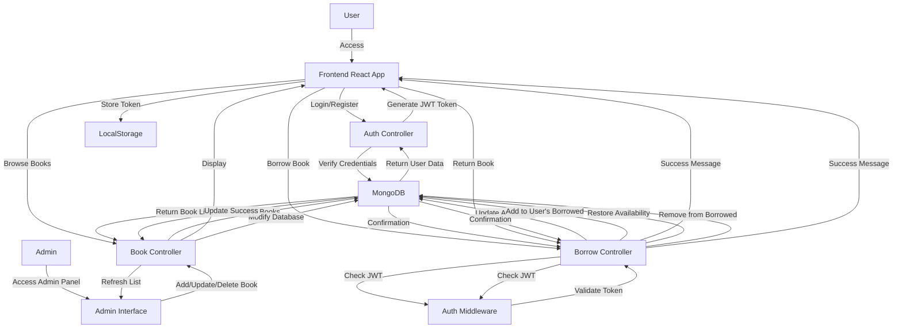

# Book Library Management System

A full-stack web application for managing a book library with user authentication, book borrowing/returning capabilities, and an admin panel for book management.

##  Features

### User Features
- **Authentication**: Secure user registration and login with JWT tokens
- **Book Catalog**: Browse available books with detailed information
- **Borrow/Return**: Borrow books and return them when done
- **User Profile**: View profile information and borrowed books history
- **Real-time Updates**: Live availability tracking for books

### Admin Features
- **Book Management**: Add, update, and delete books
- **Inventory Control**: Manage total and available copies
- **Book Statistics**: View library statistics and analytics
- **Search & Filter**: Advanced search capabilities for book management

##  Tech Stack

### Frontend
- **React** (v19.2.0) - UI framework
- **React Router DOM** (v7.9.5) - Navigation and routing
- **Axios** (v1.13.2) - HTTP client
- **Tailwind CSS** (v4.1.17) - Styling
- **Lucide React** - Icons
- **React Toastify** (v11.0.5) - Toast notifications
- **Vite** - Build tool and dev server

### Backend
- **Node.js** with **Express** (v5.1.0) - Server framework
- **MongoDB** with **Mongoose** (v8.19.3) - Database
- **JWT** (jsonwebtoken v9.0.2) - Authentication
- **Bcrypt** (v6.0.0) - Password hashing
- **Cookie Parser** (v1.4.7) - Cookie management
- **CORS** (v2.8.5) - Cross-origin resource sharing
- **Cloudinary** (v2.8.0) - Image storage
- **Multer** (v2.0.2) - File upload handling

##  Prerequisites

- Node.js (v14 or higher)
- MongoDB (local or Atlas)
- npm or yarn package manager

##  Installation & Setup

### 1. Clone the Repository
```bash
git clone <repository-url>
cd "Book Libary"
```

### 2. Backend Setup
```bash
cd backend
npm install
```

Create a `.env` file in the backend directory:
```env
PORT=4000
MONGODB_URI=your_mongodb_connection_string
JWT_SECRET=your_jwt_secret_key
CLOUDINARY_CLOUD_NAME=your_cloudinary_name
CLOUDINARY_API_KEY=your_cloudinary_key
CLOUDINARY_API_SECRET=your_cloudinary_secret
```

### 3. Frontend Setup
```bash
cd frontend
npm install
```

### 4. Run the Application

**Start Backend Server:**
```bash
cd backend
npm start
```
Server will run on `http://localhost:4000`

**Start Frontend Development Server:**
```bash
cd frontend
npm run dev
```
Frontend will run on `http://localhost:5173`

##  Project Structure

```
Book Libary/
├── backend/
│   ├── config/
│   │   └── db.js                 # MongoDB configuration
│   ├── controllers/
│   │   ├── auth.controller.js    # Authentication logic
│   │   ├── book.Controller.js    # Book CRUD operations
│   │   └── borrow.controller.js  # Borrow/return logic
│   ├── middlewares/
│   │   └── auth.middleware.js    # JWT verification
│   ├── models/
│   │   ├── Book.model.js         # Book schema
│   │   └── user.model.js         # User schema
│   ├── routes/
│   │   ├── auth.routes.js        # Auth endpoints
│   │   ├── book.routes.js        # Book endpoints
│   │   └── borrowBook.routes.js  # Borrow endpoints
│   ├── package.json
│   └── server.js                 # Express app entry
│
└── frontend/
    ├── public/
    ├── src/
    │   ├── assets/
    │   ├── components/
    │   │   ├── admin/            # Admin panel components
    │   │   │   ├── BookAdminPanel.jsx
    │   │   │   ├── BookCardAdmin.jsx
    │   │   │   ├── BookModelAdmin.jsx
    │   │   │   ├── BookStats.jsx
    │   │   │   └── SearchBar.jsx
    │   │   ├── auth/             # Authentication components
    │   │   │   ├── LoginForm.jsx
    │   │   │   └── SignupForm.jsx
    │   │   ├── context/          # React Context
    │   │   │   └── LibraryContext.jsx
    │   │   ├── hooks/            # Custom hooks
    │   │   │   ├── useCountUp.js
    │   │   │   └── useDebounce.js
    │   │   ├── pages/            # Main pages
    │   │   │   ├── CatalogPage.jsx
    │   │   │   ├── HomePage.jsx
    │   │   │   └── ProfilePage.jsx
    │   │   ├── AnimatedStatCard.jsx
    │   │   ├── BookCard.jsx
    │   │   ├── EmptyState.jsx
    │   │   ├── Navbar.jsx
    │   │   ├── SearchInput.jsx
    │   │   └── Toast.jsx
    │   ├── App.jsx               # Main app component
    │   ├── axios.jsx             # Axios configuration
    │   ├── main.jsx              # React entry point
    │   ├── App.css
    │   └── index.css
    ├── index.html
    ├── package.json
    └── vite.config.js
```

##  Application Flow



## API Endpoints

POSTMAN DOCUMENTS-https://documenter.getpostman.com/view/48539018/2sB3WtsySF

### Authentication Routes (`/api/auth`)
| Method | Endpoint | Description |
|--------|----------|-------------|---------------|
| POST | `/register` | Register new user |
| POST | `/login` | User login |
| GET | `/profile` | Get user profile |
| POST | `/logout` | User logout |

### Book Routes (`/api/books`)
| Method | Endpoint | Description | 
|--------|----------|-------------|
| POST | `/add-book` | Add new book |
| GET | `/get-books` | Get all books |
| PUT | `/update-book/:id` | Update book |
| DELETE | `/delete-book/:id` | Delete book |

### Borrow Routes (`/api/borrow`)
| Method | Endpoint | Description | Auth Required |
|--------|----------|-------------|---------------|
| PUT | `/:id` | Borrow a book |
| PUT | `/return/:id` | Return a book |
| GET | `/user-borrowed-books` | Get user's borrowed books |

## Database Schema

### User Model
```javascript
{
  name: String,
  email: String (unique),
  password: String (hashed),
  Phonenumber: Number,
  role: String (User/Admin),
  borrowedBooks: [{
    bookId: ObjectId,
    title: String,
    borrowDate: Date,
    returnDate: Date,
    returned: Boolean
  }],
  timestamps: true
}
```

### Book Model
```javascript
{
  title: String,
  authors: [String],
  ISBN: String (unique),
  genre: String,
  totalCopies: Number,
  availableCopies: Number,
  description: String,
  coverUrl: String,
  createdAt: Date
}
```

##  Security Features

- **JWT Authentication**: Secure token-based authentication
- **Password Hashing**: Bcrypt with salt rounds for password security
- **HTTP-Only Cookies**: Secure cookie storage for tokens
- **CORS Protection**: Configured for specific origin access
- **Protected Routes**: Middleware-based route protection
- **Role-Based Access**: User and Admin role separation

##  Key Features Implementation

### User Authentication Flow
1. User registers with credentials
2. Password is hashed using bcrypt
3. JWT token is generated and sent to client
4. Token stored in localStorage and sent with each request
5. Backend verifies token using middleware

### Book Borrowing System
1. User selects book from catalog
2. System checks if book is available
3. If available, decrements available copies
4. Adds book to user's borrowed list
5. Updates displayed in real-time

### Admin Panel
1. Admin can add new books with details
2. Update existing book information
3. Delete books from inventory
4. View library statistics
5. Search and filter books

##  Custom Hooks

- **useCountUp**: Animated number counter for statistics
- **useDebounce**: Debounced search functionality

##  Future Enhancements

- [ ] Email notifications for due dates
- [ ] Book reservation system
- [ ] User reviews and ratings
- [ ] Advanced search filters
- [ ] Due date reminders
- [ ] Fine calculation for overdue books
- [ ] Export reports (PDF/CSV)
- [ ] Multi-language support

##  Known Issues

- None currently reported


##  Contributors

- Chandan - Full Stack Developer

## Contact

For questions or support, please contact: chandanbo345@gmail.com

---

**Happy Reading! 📖**
